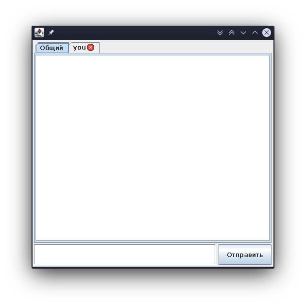

# SimpleMessenger
My own's messenger
This is a messenger with client and server. It uses sokects to connect. It also uses DB(SQLite) for saving users accounts data.
Client has GUI. 
Это довольно простой мессенджер, он состоит из клиентской и серверной части. Серверная часть использует базу данных SQLite для сохраняния аккаунтов.
Клиентская часть имеет графический интерфейс.
## Немного скриншотов

